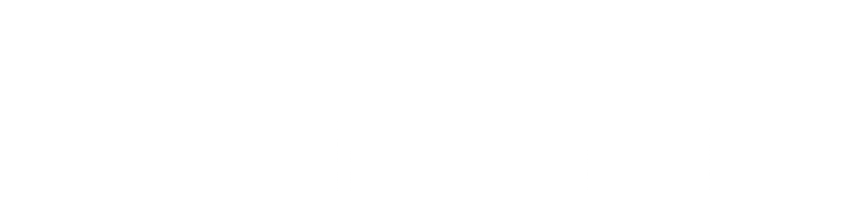
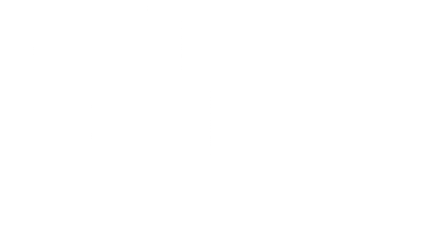
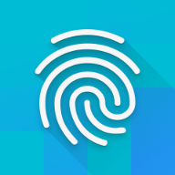

<div>
  
  
</div>

<br/>
<br/>

#  My MM

This repository holds the code and resources for the internal slack app of Manage and More.

# Outline

- [**Overview**](#overview)
  - [**Components**](#components)
  - [**Project Structure**](#project-structure)
  - [**Features**](#features)
- [**Development**](#development)
  - [**Ground Rules**](#ground-rules)
  - [**Development Setup**](#development-setup)
- [**Deployment**](#deployment)

# Overview

The **My MM** app is an internal tool for and by Manage And More. Its goal is to make MM scholars more productive with everyday tasks inside the MM ecosystem.

The tool comes in form of a custom **Slack App**, which lives inside the official Manage And More slack workspace. This way it can integrate into the existing workflow of a scholar without the need for logging into _yet another tool_. Internally, we can thereby leverage the existing authentication system, platforms (mobile and desktop apps) and UI surfaces.

For data storage we integrate into the official Manage And More notion workspace. We effectively use notion as a database for the app. This has the advantage that we have no additional service to maintain and everyone has access to the stored data. This is especially important for if the app would be unavailable at some point that the data will still be accessible. Also it means the app is not required to implement full data handling capabilities (create, edit, delete) for all features, but instead can implement a subset and rely on manual notion editing for the rest (e.g. create new information through the app, but allow to edit through notion).

The app is built in a modular way to encompass several independent use-cases. It uses a feature based approach to be easily maintainable and extendable in the future.

## Components

The following table gives an overview of the high-level system components the app consists of and what producs or services we use for each.

| Component       | Product or Service    | Link                                               | Pricing              |
| --------------- | --------------------- | -------------------------------------------------- | -------------------- |
| User Interface  | Slack Integration     | https://api.slack.com/start/apps                   | Free                 |
| Data Storage    | Notion Integration    | https://developers.notion.com/docs/getting-started | Free                 |
| Server Hosting  | Vercel Edge Functions | https://vercel.com/docs/functions/edge-functions   | Free Tier / 20$/mo   |
| LLM             | OpenAI GPT            | https://openai.com/product                         | Pay per Use (~5$/mo) |
| Vector Database | Vercel Postgres       | https://vercel.com/docs/storage/vercel-postgres    | Free with Hosting    |
| Cache Database  | Vercel KV (Redis)     | https://vercel.com/docs/storage/vercel-kv          | Free Tier            |

## Project Structure

- `api/`: Top level api routes. Each file defines a `/api/<filename>` route.
  - `events.ts`: Entrypoint for slack events, messages and shortcuts.
  - `social.ts`: Generates an image in a specific layout, used by the social media post generator.
  - `sync.ts`: Syncs the notion ai index to the vector database, triggered by a daily cron job.
  - `checkReminders.ts`: Checks what overdue reminders are in inboxes and sends them to the users. Triggered daily by a cron job.
- `src/`: Contains the source code.
  - `features/`: The features of the application in separate folders.
    - `<featurename>/`
      - `_FEATURE.md`: Specific documentation for a single feature.
      - `index.ts`: Entrypoint for a feature, should be imported in `/api/events.ts`
  - `constants.ts`: Constant environment variables, like tokens for slack and notion.
  - `notion.ts`: The notion api client.
  - `slack.ts`: The slack api client.
- `manifest.yaml`: Stores the current config for the production slack app, used as a template for all other apps.

## Features

Below is the table of all existing features and their documentation:

| Feature           | Description                                        | Documentation                                            |
| ----------------- | -------------------------------------------------- | -------------------------------------------------------- |
| Common            | Common functionality shared across other features. | [FEATURE.md](./src/features/common/_FEATURE.md)          |
| Home              | The apps home screen.                              | [FEATURE.md](./src/features/home/_FEATURE.md)            |
| Profile           | The profile of a user.                             | _TODO_                                                   |
| Assistant         | The ai assistant for asking questions.             | _TODO_                                                   |
| Skill Interface   | Managing the skills of a user.                     | [FEATURE.md](./src/features/skill_interface/_FEATURE.md) |
| Community Credits | Credit leaderboard and channel management.         | _TODO_                                                   |
| Wishlist          | New feature suggestions.                           | [FEATURE.md](./src/features/wishlist/_FEATURE.md)        |
| Post Creator      | Social media post creation.                        | [FEATURE.md](./src/features/post_creator/_FEATURE.md)    |

# Development

We use Github for managing the development process. The repository is hosted here: https://github.com/schultek/my_mm. Every change has to be made in a Pull Request to either the `staging` or `main` branch. We use issues for tracking bugs and new features.

## Ground Rules

Below are a few ground rules and best practices to follow when developing this app. The goal is to produce clean, consistent and understandable code so that following semesters of MM scholars can maintain this app. The rules are allowed to be extended or changed over time as long as they follow the goal and work for the current active team.

- **Think feature-first**: Since the app contains many, often independently working features we use a feature-first approach to the architecture of this app. Each new feature gets a folder under `src/features/` that contains all its event handlers, business logic and data access.

- **Document everything**: Documentation is vital for the maintainability of this app, since team members are expected to change frequently. We document both on a code level and on a feature level.

  - In the code, use jsdoc comments (\/\*\* ... \*/) on **every** top-level element, like event handlers, functions, constants or classes. Additionally use normal comments (// ...) throughout your implementation to explain key logic.
    - Read the jsdoc guides here: https://jsdoc.app/
    - Also refer to this on how to use clear and effective language in comments: https://dart.dev/effective-dart/documentation. Some good rules include:
      - Write all comments as sentences (Capitalize first word, end with ‘.’).
      - Write in present tense.
      - Separate the first sentence of a multi-line comment into its own paragraph.
      - Be clear and precise, but also terse.
  - For each feature, create a `<featurename>/_FEATURE.md` file containing higher-level documentation for this feature. This should at least contain three sections: General description, overall and complete functionality and the structure of the feature. Link this document in the features table above.

- **Use well-defined typing**: Typescript allows us to be clear about the types of our objects and catch potential errors already when writing the code. We want to leverage this ability the best we can. Both the slack and notion packages we use come with well-defined types. We also added additional type structures for notion queries and feature flags that should be used.

- **Name consistently**: We use prettier as our code formatter. Additionally we want to use a consistent naming for our files, variables and methods across the codebase. For files use **snake_case**, for variables and methods use **camelCase**, for types and interfaces use **PascalCase**.

- **Reduce notion api calls**: Compared to a normal database, fetching data from notion is really slow. Therefore we aim to reduce the number of api calls to notion. This is not only needed for a smooth user experience, but also since slack expects responses to an incoming event in less than 3 seconds. There are two main ways to improve the performance of data-fetching tasks:
  - Cache appropriate data using the redis store. We use redis as a key-value store to cache data that is expected to change very rarely, such as the mapping of user ids between slack and notion.
  - Use relations and rollups in notion. When relying on related data from multiple notion databases, using rollup properties is much faster, since you reduce the number of databases you need to query.

## Development Setup

For development, you will create a personal slack app and api application. The slack app will be added
to the **ManageAndMore Test** Workspace. For hosting the api, we use vercel (because its easy and free). For data storage, we use notion with the **ManageAndMore Test** notion workspace.

Running the api locally is currently not supported, since the slack app, even your personal one, needs to access the api from the internet. You need to deploy your code to a personal vercel project in order to test it in slack. However deployments are rather quick. This does not affect the production or staging apps.

---

### 0. Prerequisites

You need the following prerequisites:

- Installed **NodeJS** and **npm**
- Installed and setup **vercel** cli (https://vercel.com/docs/cli)
- Setup code linting (optional):
  - Install `Prettier` extension on VS Code: https://marketplace.visualstudio.com/items?itemName=esbenp.prettier-vscode
  - Enable `format on save` in VS Code: https://stackoverflow.com/questions/39494277/how-do-you-format-code-on-save-in-vs-code
- Given access to the **ManageAndMore Test** slack workspace.
- Given access to the **ManageAndMore Test** notion workspace.
- Created a personal vercel account (https://vercel.com/signup)
  - Select the Hobby plan for free projects

### 1. Project Init

For starters clone the git repository into a new directory called `mm_app`:

```shell
git clone https://github.com/schultek/mm_app mm_app
cd mm_app
```

### 2. Vercel Project Setup

Inside the `mm_app` folder, initialize a new vercel project through the vercel cli:

```shell
vercel
```

Answer the prompts so that you setup your project for your private vercel account.
You might need to login to the cli when prompted.
Select `N` when asked to link an existing project and enter the details for a new project.

---

Next go to `vercel.com` and open your project dashboard. Go to the `Storage` tab and add two databases:

- **KV** for caching.
- **Postgres** for vector embeddings.

---

Go to `Settings` -> `Domains` and note down your projects domain for production deployments. Create one if none exists.

### 3. Slack App Setup

Next create your own custom slack app like this:

- Go to `https://api.slack.com/apps/` and signin with your MM account
- Create a new slack app -> From an app manifest
- Select the **ManageAndMore Test** Workspace
- Copy the content of `manifest.yaml` into the text area and adjust the following:
  - Change `display_information.name` to a custom name
  - Change `features.bot_user.display_name` to the same name
  - Change `settings.event_subscriptions.request_url` to `https://<your-domain.vercel.app>/api/events` using your vercel project domain you noted down earlier.
  - Change `settings.interactivity.request_url` to the same url.
- Click **Create**

Then install the app to the workspace as prompted.

---

Open your vercel project dashboard and go to `Settings` -> `Environment Variables`

Add the following variables:

- `SLACK_SIGNING_SECRET` as found under **Basic Information** -> **App Credentials** -> **Signing Secret**
- `SLACK_BOT_TOKEN` as found under **OAuth & Permissions** -> **Bot User OAuth Token**

### 4. Notion Setup

Add the `NOTION_INTEGRATION_TOKEN` environment variable in the vercel settings with the following:

- Go to `https://www.notion.so/my-integrations`
- Open the **MM App** integration
- Copy the **Internal Integration Secret** to the env var.

### 5. OpenAI Setup

Either get a real OpenAI Api token from a personal account, or make up a dummy token (e.g. 'DUMMY_TOKEN').
Add your token as the `OPENAI_TOKEN` environment variable in the vercel settings.

### 6. Deploy Development App

To deploy your personal development app run:

```shell
vercel deploy --prod
```

# Deployment

We have three deployment environments for the app:

**Development** is your own environment you set up above which you can use during development to quickly iterate on your personal changes without affecting the other developers. To deploy to this environment, run `vercel deploy --prod`.

**Staging** is for testing new changes in an environment that is similar to production, but in a separate slack and notion workspace. To deploy to staging, push commits to the **staging** branch of this git repository.

**Production** is the live app in the real ManageAndMore slack and notion workspaces. To deploy to production, open and merge a pull request to the **main** branch of this git repository.
